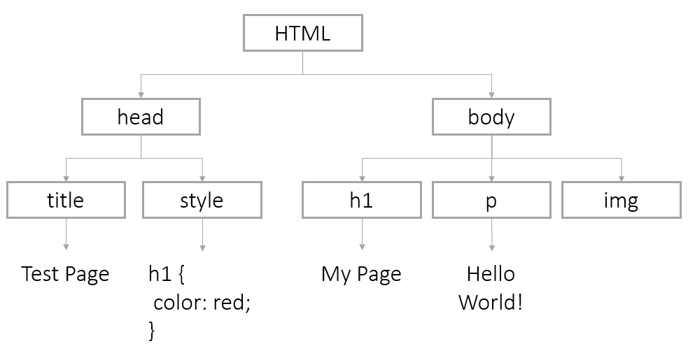

# JavaScript and the DOM

---

> The Document Object Model (DOM) is a programming interface for HTML documents. It represents the page so that programs can change the document structure, style and content. The DOM represents the document as nodes and objects. That way, programming languages can connect to the page.

-- [MDN, _Introduction to the DOM_](https://developer.mozilla.org/en-US/docs/Web/API/Document_Object_Model/Introduction)

Think of it as **the code representation** of the html and css that the browser displays.

We can change the page by **using JavaScript to interact with the DOM**.

---

# The DOM tree and DOM nodes



---

# Read this code

What do you think it does?

```js
for (let headshot of document.querySelectorAll('.staff-member__headshot')) {
  headshot.addEventListener('mouseover', function (event) {
    headshot.src = headshot.dataset['gif']
  })
  headshot.addEventListener('mouseout', function (event) {
    headshot.src = headshot.dataset['src']
  })
}
```

---

# Selecting DOM nodes

You can find and "grab" elements on the page (DOM nodes) with JavaScript.

```html

```

There is more than one way to do this.

```js
let image = document.getElementById('kitten-pic')
let image = document.querySelector('#kitten-pic')
```

---

# querySelector and querySelectorAll

We can use CSS selectors to get elements.

```js
// This will return the first element matching the provided selector
document.querySelector('.profile-photo')

// This returns a collection of elements matching the selector
document.querySelectorAll('.profile-photo')
```

---

# Changing things in the DOM

Once we can select DOM elements, we can make changes to them.

We can use JavaScript for...

- Adding or removing element attributes
- Adding or removing classes
- Adding or removing entire elements and/or their content

Let's look at how to do this!

---

# Updating element attributes

```js
let mainImg = document.querySelector('#main-image')
mainImg.src
// what will this return?
mainImg.src = 'https://source.unsplash.com/200x300/?ocean'
// sets the src attribute to this value
mainImg.style.border = '4px solid purple'
// sets the style attribute and border property to this value
```

---

# Changing classes

Making changes to classes lets us apply styles to, or remove styles from, elements in the DOM.

```js
let el = document.querySelector('.input--name')
el.classList.add('highlight')
```

---

# Adding things to the DOM

```js
// First select where you want to place the new content
let existingElement = document.querySelector(".empty-div");

// Create the new element, in memory only!
let newElement = document.createElement("div");

// Create some text, also in memory only!
let text = document.createTextNode("Hello there!");

// Add text to new element, still just in memory
newElement.appendChild(text);

// Add that element to the DOM -- NOW it's on the page!
existingElement.appendChild(newElement);
```

---

# Removing things from the DOM

```js
let elementToRemove = document.querySelectorAll('li')[2]
elementToRemove.remove()
```

---

# Traversing the DOM

Sometimes you need to navigate from element to element.

```js
// Get an element's immediate parent element.
element.parentNode

// Get the first or last child of an element
element.firstChild
element.lastChild

// Get the element that is right after or right before an element (not nested as a child)
element.nextSibling
element.previousSibling
```

---

## innerHTML

Setting the  `.innerHTML` property of elements allows you to replace all the children of an element. It's easy to accidentally replace too much this way, so be careful.

```js
let element = document.getElementById('product-title')
element.innerHTML = '<h2>Boomerang</h2>'
```

---

# Template literals

If you find yourself using `.innerHTML` often, _template literals_ can make it easier to create a bunch of HTML.

Template literals allow you to interpolate code in your string.

```js
let name = 'Amani'
let content = `<h2>Hello, ${name}!</h2>`
```

---

# JavaScript events

User interactions create events on the page.

JavaScript can handle these events: detecting when something happens and doing something in response, including changing the DOM or triggering other events.

---

# Some Types of Events

- when the page loads
- a mouse click or movement
- a tap on a touchscreen
- when a key is pressed
- when something is selected

---

# Event handling

Let's say you want a certain function to run when an image on the page is clicked.

- Select the DOM node for the element that will be clicked (in this example, the image -- but it can be any element).
- [Choose the event](https://developer.mozilla.org/en-US/docs/Web/Events) that will act as the trigger for the function (here, the mouse click, but it can be any event on that list).
- Specify the function that you wish to run when the event occurs.

---

# Event listeners

```js
let button = document.querySelector('.cancelButton')
button.addEventListener('click', function () {
  alert('Are you sure you want to cancel?')
})
```

Here we are passing two arguments to the event listener method:

- the event you want to respond to[^1]
- the _callback function_ to run when that event happens

[^1]: There are a lot of events you could listen for. Consult the [MDN Event Reference](https://developer.mozilla.org/en-US/docs/Web/Events) for their names.
{"mode":"full","isActive":false}
